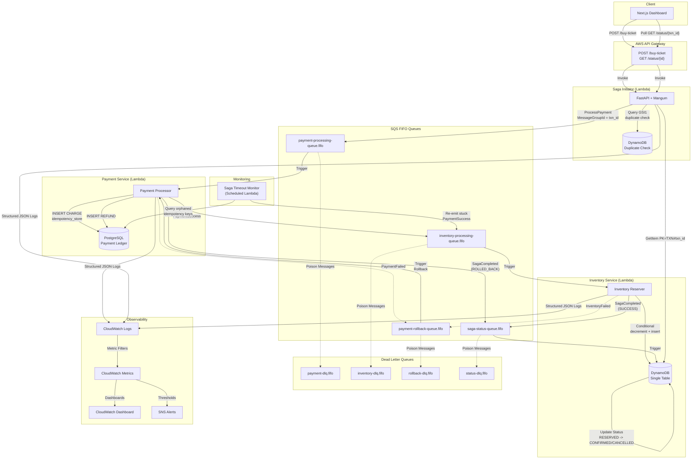
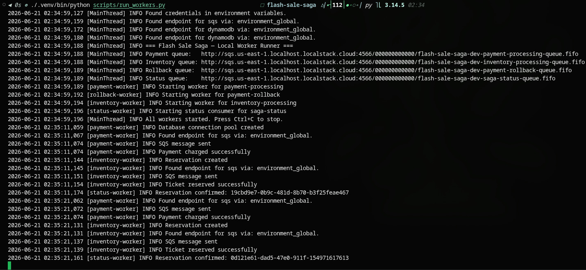
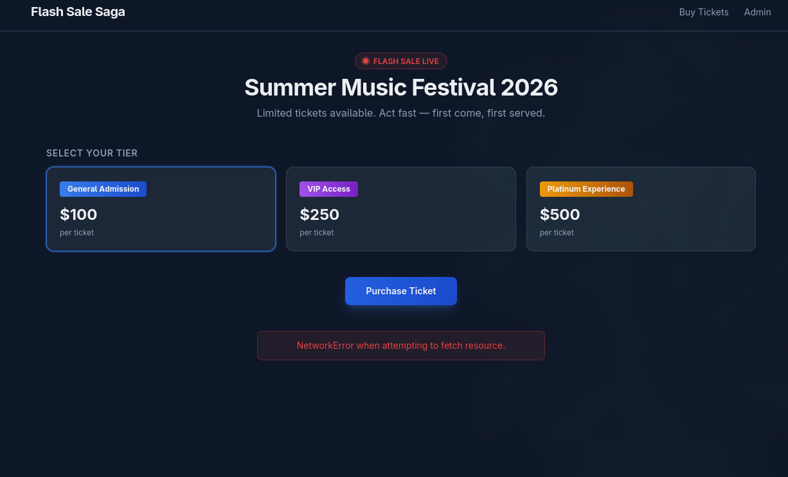
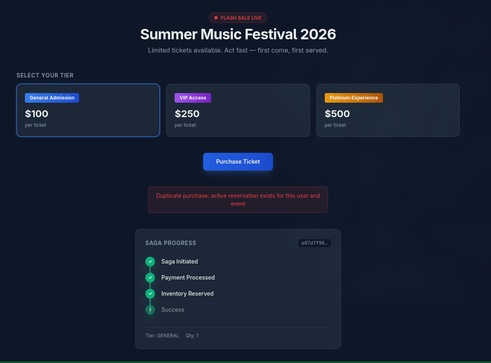

# Flash Sale Saga

**Enterprise-Grade Distributed Ticketing Platform** — a serverless, event-driven saga implementation that guarantees exactly-once payment processing, zero overselling, and zero double charges under flash-sale concurrency.

---

## Architecture Overview

The system uses the **Saga Choreography** pattern with **AWS SQS FIFO** for ordered, exactly-once message delivery. Four microservices communicate purely via events — no central orchestrator, no distributed locks, no two-phase commit.



### Saga State Machine

```
INITIATED -> PAYMENT_PROCESSING -> (Success?) --yes--> INVENTORY_PROCESSING -> SUCCESS
                                       |
                                       no
                                       |
                                       v
                                  ROLLED_BACK (refund issued)
```

### Failure Modes Handled

| Scenario | Mechanism |
|---|---|
| Double-click "Buy" | Idempotency key (UUID v4) + DynamoDB GSI1 duplicate check |
| Payment succeeds, Lambda crashes before emit | Saga Timeout Monitor re-emits from idempotency table |
| Inventory exhausted after payment | Payment Rollback queue issues refund |
| SQS poison message (max retries) | DLQ captures with CloudWatch Alarm -> SNS |
| Stale idempotency lock (>5 min) | Saga Monitor detects and recovers |

---

## Prerequisites

| Tool | Version | Purpose |
|---|---|---|
| Python | **3.12+** | Backend services & tests |
| Node.js | **20+** | Frontend (Next.js 14) |
| Terraform | **1.5+** | Infrastructure-as-Code |
| AWS CLI | **2.x** | LocalStack interaction & DLQ ops |
| Docker | **24+** | LocalStack for local development |
| PostgreSQL | **15+** | Payment ledger (local: NeonDB or Docker) |

---

## Local Setup

This guide assumes Docker, AWS CLI, `psql`, Python 3.12+, and Node.js 20+ are already installed. If Docker requires elevated access on your machine, use `sudo docker compose ...` or add your user to the `docker` group.

### 1. Clone & venv

```bash
git clone https://github.com/<org>/flash-sale-saga.git
cd flash-sale-saga
python3.12 -m venv .venv
source .venv/bin/activate.fish
```

### 2. Install Backend Services (editable mode)

```bash
# Install in dependency order
pip install -e ./shared
pip install -e ./payment
pip install -e ./inventory
pip install -e ./saga_initiator
```

### 3. Start Docker services

```bash
docker compose up -d
```

If your user cannot access the Docker socket, run `sudo docker compose up -d` instead.

### 4. Initialize infrastructure locally

```bash
bash scripts/localstack-init.sh
bash scripts/seed-dynamodb.sh
bash scripts/seed-postgres.sh
```

The root `.env` is already configured for the LocalStack endpoints and the local Postgres container. If you change ports or hostnames, update those values before starting the API.

### 5. Start the API

```bash
./.venv/bin/uvicorn saga_initiator.main:app --app-dir saga_initiator --reload --port 8000
```

Verify the API is healthy at `http://localhost:8000/health`.

### 6. Start the local workers

In production, AWS Lambda functions are triggered automatically by SQS.
Locally, a worker runner script polls the SQS queues and dispatches
messages to the service handlers:

```bash
./.venv/bin/python scripts/run_workers.py
```

Leave this running in a separate terminal — it processes the payment,
inventory, rollback, and status queues so sagas actually complete.

### 7. Start the frontend

```bash
cd frontend
npm install
npm run dev
```

The frontend reads its demo settings from `frontend/.env.local`, including the API base URL and the seeded event ID.

Open **http://localhost:3000** to see the flash sale dashboard.

### 8. Demo flow

If you want to record a clean happy-path video, use this order:

```bash
docker compose up -d
bash scripts/localstack-init.sh
bash scripts/seed-dynamodb.sh
bash scripts/seed-postgres.sh
./.venv/bin/uvicorn saga_initiator.main:app --app-dir saga_initiator --reload --port 8000
./.venv/bin/python scripts/run_workers.py
cd frontend && npm install && npm run dev
```

Then open the UI and run a purchase from the dashboard.

---

## Project Proof

The screenshots below show the local system running end to end. Each one ties a visible UI or terminal state back to the saga design and the underlying data flow.

### 1. End-to-End Saga Completion


This screenshot shows the happy path completing successfully. On the left, the customer-facing UI displays a finished four-step saga tracker, which confirms the progression from purchase initiation to payment processing, inventory reservation, and final success. On the right, the Admin Dashboard shows live operational metrics, including total sales, in-flight sagas, and remaining inventory.

This image is the clearest proof that the system is wired correctly across the frontend, the saga initiator, the payment path, the inventory path, and the admin telemetry surface. It also demonstrates the dual-store design: the dashboard combines DynamoDB inventory state with PostgreSQL payment aggregates.

### 2. SQS FIFO & Distributed Workers



This terminal capture shows the local worker runner processing messages from the LocalStack queues. The log stream shows separate worker roles handling payment, inventory, rollback, and status responsibilities independently, which reflects the choreographed saga architecture used in the project.

The sequence is important: the payment worker charges the transaction, emits the next event, and the inventory worker consumes it to reserve the ticket. That progression is the proof point for ordered FIFO delivery, `MessageGroupId` routing, and the system's exactly-once style processing guarantees.

### 3. Graceful Client Degradation



This screenshot shows the frontend displaying a `NetworkError when attempting to fetch resource` message after a purchase attempt. It is a useful proof case because it demonstrates safe failure at the first hop of the architecture: the saga initiator API is not reachable, so the client stops cleanly before any payment event is emitted.

The important detail is what does not happen. No charge is written to PostgreSQL and no message is placed on the SQS payment queue, so there is no orphaned transaction and no compensating rollback requirement.

### 4. Double-Submit Protection



This screenshot shows the UI blocking a duplicate purchase with the message `Duplicate purchase: active reservation exists for this user and event`. It is direct evidence that the saga initiator is enforcing idempotency before sending a new payment event into the queue.

Under the hood, the service checks the DynamoDB GSI for an existing active reservation for the same user and event. If it finds one, it returns `409 Conflict` instead of allowing a second transaction to proceed. That prevents race conditions and protects the payment ledger from duplicate charges.

### 5. Anti-Overselling & Inventory Exhaustion


This admin dashboard screenshot shows the Platinum tier at exactly `0` remaining while the other tiers still have stock. That state is the proof that inventory updates are being controlled by DynamoDB conditions instead of fragile application-side counters or row locks.

If a payment completes but the final inventory decrement cannot be applied, the inventory path emits an `InventoryFailed` event and routes the saga into the rollback flow. That keeps the system financially consistent and prevents overselling even under heavy concurrency.

---

## Load Testing

```bash
pip install locust

export API_GATEWAY_URL="https://your-api-id.execute-api.us-east-1.amazonaws.com/prod"

# Interactive UI
locust -f scripts/load_test.py --host "$API_GATEWAY_URL"

# Headless -- 1,000 concurrent users, 60 seconds
locust -f scripts/load_test.py \
  --host "$API_GATEWAY_URL" \
  --headless --users 1000 --spawn-rate 100 --run-time 60s \
  --csv results/flash_sale
```

See `scripts/README-load-test.md` for all profiles (smoke, steady, burst, stress, soak).

---

## Testing

```bash
# All backend tests (160 total)
pytest shared/ payment/ inventory/ saga_initiator/ -v

# With coverage
pytest --cov=shared --cov=payment --cov=inventory --cov=saga_initiator --cov-report=term-missing
```

| Component | Tests | Coverage Target |
|---|---|---|
| Shared | 97 | >=95% |
| Payment | 16 | >=90% |
| Inventory | 27 | >=90% |
| Saga Initiator | 20 | >=90% |

---

## Deployment

```bash
cd infrastructure
cp terraform.tfvars.example terraform.tfvars
# Edit terraform.tfvars with your AWS account details

terraform init
terraform plan
terraform apply
```

### Terraform Modules

| Module | Resources |
|---|---|
| `sqs` | 4 FIFO queues + 4 DLQs with redrive policies |
| `dynamodb` | Single table with GSI1 (user-event lookup) |
| `lambda` | 4 Lambda functions + CloudWatch log groups |
| `api_gateway` | REST API: POST /buy-ticket, GET /status/{id} |
| `iam` | Least-privilege roles per Lambda |
| `cloudwatch` | Dashboard, alarms, metric filters |

---

## DLQ Operations

```bash
# Inspect messages in a DLQ
./scripts/drain-dlq.sh --queue payment-rollback-dlq.fifo --action inspect

# Redrive messages back to source queue
./scripts/drain-dlq.sh --queue payment-rollback-dlq.fifo --action redrive

# Purge (requires --confirm)
./scripts/drain-dlq.sh --queue payment-rollback-dlq.fifo --action purge --confirm
```

---

## Project Structure

```
flash-sale-saga/
├── shared/              # Shared library (events, config, exceptions, SQS client)
├── payment/             # Payment Lambda (charge, refund, idempotency)
├── inventory/           # Inventory Lambda (reserve, confirm, cancel)
├── saga_initiator/      # FastAPI API (POST /buy-ticket, GET /status/{id})
├── frontend/            # Next.js 14 dashboard (dark mode, saga visualizer)
├── infrastructure/      # Terraform (SQS, DynamoDB, Lambda, API GW, IAM, CloudWatch)
│   └── modules/         #   sqs, dynamodb, lambda, api_gateway, iam, cloudwatch
├── scripts/             # Seed scripts, DLQ drain, Locust load test, reconcile
├── docs/                # System design doc, runbook, reconciliation reports
└── .github/workflows/   # CI/CD pipeline
```

---

## Financial Integrity

The system guarantees **zero-sum consistency** across PostgreSQL and DynamoDB:

- Every CHARGE has a matching reservation OR a matching REFUND
- `SUM(CHARGE) - SUM(REFUND)` = `tickets_sold x price_cents`
- No transaction_id has >1 CHARGE entry
- DynamoDB `total_qty - available_qty` = `COUNT(reservations with status RESERVED)`

Post-test reconciliation queries are documented in `docs/SYSTEM_DESIGN_DOCUMENT.md` §6.3.4.

---
